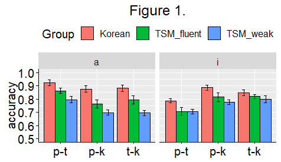
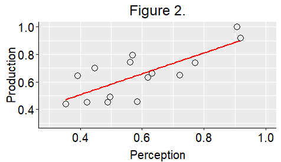

# Linguistic-MA-Thesis
This is a repo that contains all my R scripts I created for my thesis 

## Title
**Loss of final stops among young Mandarin-Min bilingual speakers in Taiwan**

## The present study
`The present study examined the patterns of the loss of final stop contrasts among young Mandarin-Min bilingual speakers in Taiwan`

## Abstract
### Introduction
Young bilingual speakers often have a limited exposure to TSM, which may result in imperfect learning of the language (Halle, 1962). Focusing on weak phonetic cues to unreleased final stops (Sharf & Hemeyer, 1972), we explore the patterns of imperfect acquisition of the final stops by bilingual speakers to provide synchronic evidence for the loss of final stop place contrasts. The performance of TM speakers was compared to Korean speakers who are shown to perform well on the unreleased final stop identification (Chang & Mishler, 2012).

### Methods and results for perception
Thirty-eight TM and eighteen Korean college students participated in an AXB discrimination experiment. For TM listeners, seventeen listeners self-identified as TSM-fluent (M = 6.1/7) and twenty-one listeners as TSM-weak (M = 2.0/7). The stimuli consisted of disyllabic pseudo words varying in the final stops (e.g. /ma.sip/ ~ /ma.sit/ ~ /ma.sik/). The vowel context varied between /i/ and /a/. The results of the accuracy analyzed using mixed-effects logistic regression revealed language- dependent perceptual patterns: overall, Korean listeners (M =.86) performed significantly better than both TM groups, and TSM-fluent (M =.79) outperformed TSM-weak (M =.74) (Figure 1). The poorer performance of TSM-fluent listeners than Korean listeners provides unambiguous evidence for imperfect learning, suggesting unsuccessful transmission of TSM between generations (Labov, 2007). However, the better performance of TSM-fluent listeners than TSM-weak listeners demonstrate that the final stop place contrasts are not completely lost yet. 

### Methods and results for production 
In a subsequent production study, fifteen TSM-fluent speakers produced low frequency TSM words with three final stops and those without a final (e.g. /sip/ ~ /sit/ ~ /sik/ ~ /si/). Three TSM-fluent judges who showed a good stop identification coded the final stop places. The results showed that while vowel-ending words were most accurately produced (M =.98), final stops were prone to deletion and/or substitution (M(p) =.73, M(k) =.71, M(t) =.51).

### Correlation between perception and production
Importantly, a strong positive correlation was found between perception and production within an individual speaker (r(13) =.76, p =.0009) (Figure 2). This suggests that imperfect perception during transmission is a likely cause of poor production. The findings of this study contribute synchronic evidence for a potential sound change, namely the loss of stop place contrasts, arising from imperfect learning of TSM by young bilingual speakers. 

  
## Link to full paper
[:page_facing_up:Paper](https://drive.google.com/file/d/18EkLs3gQPgywdR6CMyAyZ-6jlfong8AF/view?usp=sharing)
